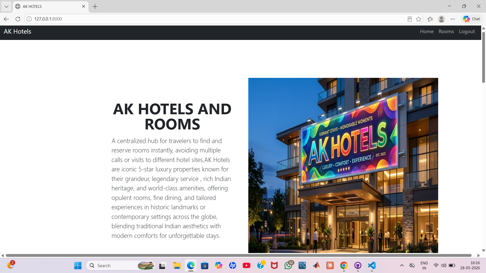
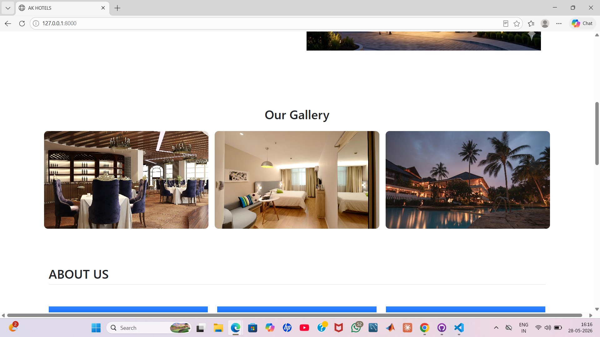
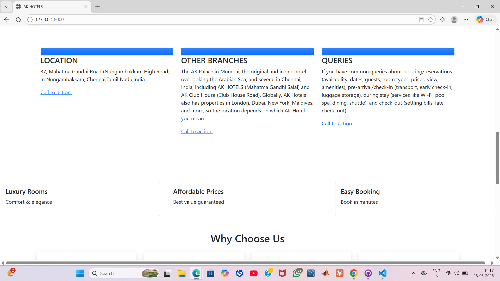
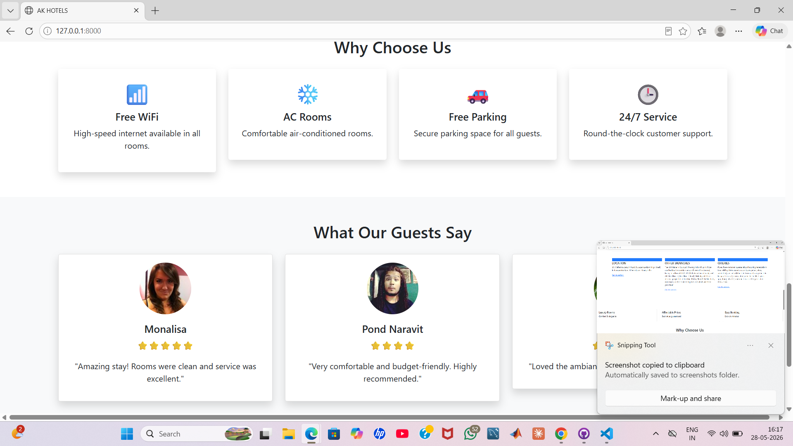
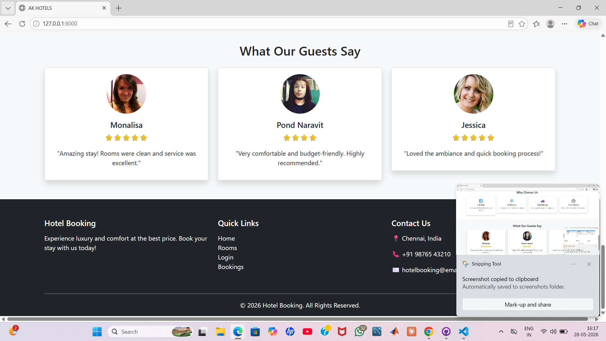
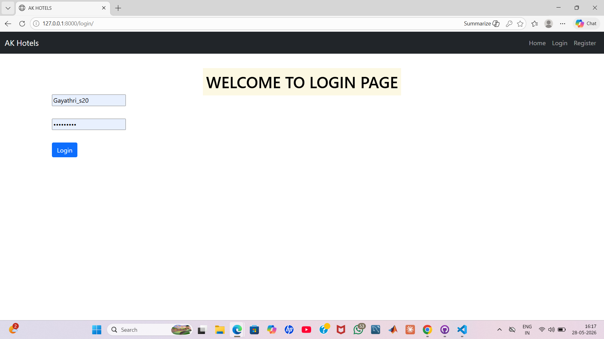
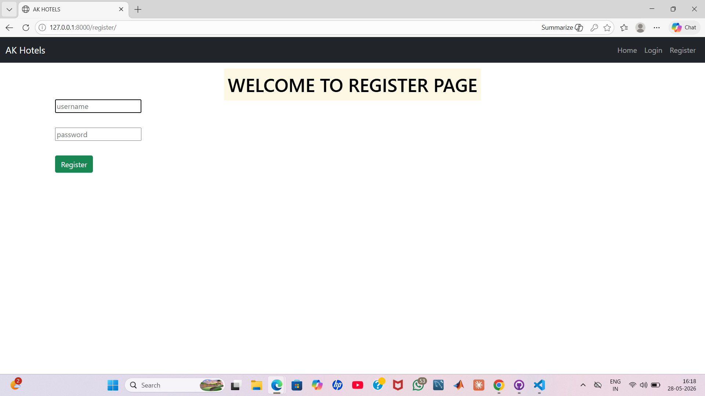
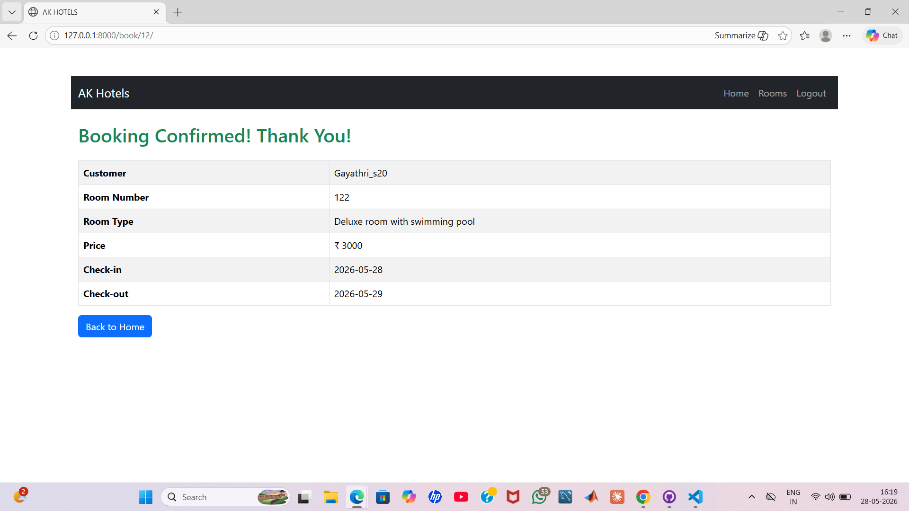

# AK hotels room booking website


A full-stack hotel room booking web application developed using HTML, CSS, JavaScript, Django, and SQLite database.

---

## 📌 Project Overview

This project allows users to view hotel rooms, check room availability, and book rooms through a simple and user-friendly interface.

---

## 🚀 Features

- Hotel room booking system
- Room availability checking
- User-friendly interface
- Responsive frontend design
- Django backend integration
- SQLite database management

---

## 🛠️ Technologies Used

### Frontend
- HTML
- CSS
- JavaScript

### Backend
- Python
- Django

### Database
- SQLite

---

## 📸 Screenshots

### Home Page












### Login Page



### Register Page




### Booking Page



## ⚙️ Installation Steps

### Clone Repository

```bash
git clone https://github.com/gayathrisuresh-eng/AK-hotels-room-booking-website.git
